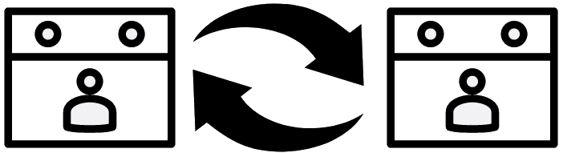

# Sync Multiple Google Calendars Together

[Video Guide here]

Are you one person with two (or more!) calendars that
- Get meeting invites
- Have separate audiences (most people can only see one calendar)
- Block your time (you can't be at two 1pm meetings)

Then you might like this script! It creates time blocks on calendars to ensure everyone knows when
you've already got events scheduled.

# Concepts

Throughout this doc I use two terms a lot:

**Primary Event** - A real event on a calendar
**Merged Event** - A placeholder on a calendar representing a Primary Event on another calendar

# Requirements

- All accounts must be Google accounts (Google Suites are fine)
- Only install on one of the merged calendar accounts
  - The account needs to have "Make changes to events" to all calendars; some clients may disable
    this access to external accounts - in this case you'll need to setup the script on the client
    account and allow access to it to the R&P calendar
- If you're already manually duplicating events between calendars, you'll need to do one of the
  following or `MergeCalendarsTogether` will treat the duplicates as Primary events
  * Delete the duplicates
  * Rename the duplicates with the Prefix to allow `MergeCalendarsTogether` to manage those events as
    Merged events

## Getting Started

1. Make sure every calendar you want sync is shared with the account that will run this script
1. Log into the account that holds the shared calendar and go to the [Google Apps Scripts] website.
1. Click on "New Project".
1. Replace everything in `Code.gs` with the contents of [MergeCalendarsTogether.gs].
1. Update `CALENDARS_TO_MERGE`, `SYNC_DAYS_IN_PAST`, and `SYNC_DAYS_IN_FUTURE` variables. Be sure to save.
1. Create a new file of type=`Script` called `BatchRequests.gs` (note: the file extension is automatically added) with the contents of [BatchRequests.gs]
1. Click the `Project Settings` Gear icon on the left panel. Check the `Show "appsscript.json" manifest file in editor`. Go back to code editor on the left, and update its content with [appsscript.json].
1. Open the `Code.gs` file again
1. run the script for the first time (also acts as a manual trigger in the future):
   - Select the `MergeCalendarsTogether` function from the dropdown to the right
     of the `Run` and `Debug` buttons
   - ⚠️ NOTE: this next step will run the script. If that makes nervous, you should
     set `DEBUG_ONLY = true` in `Code.gs`
   - Click `Run` (see next step for troubleshooting). This will load the `Authorization required`
     window since it's your first time running the script. Click on `Review permissions`
     and give it permission to your account.
   - ⚠️ If you get an error (like `TypeError: Cannot read property 'summary' of
     undefined`) in the console, check that you selected the right function to
     execute
1. Click on `Triggers` clock icon on the left panel to add a trigger. Click on `Add Trigger`.

   - You have two choices, "Time-driven" or "From calendar".
   - Time-driven will run every X minutes/hours/etc. Use this if you have calendars that update frequently (more than 5-10 times in a 15 minute timespan)
   - "From calendar" will run when a given calendar updates. Use this if you want instant merging.

     a. **Time-driven**

     - "Choose which function to run": `MergeCalendarsTogether` (note: this isn't the default option)
     - "Choose which deployment should run": `Head`
     - "Select event source": `Time-driven`
     - "Select type of time based trigger": choose what works for you.
     - Click "Save"

     b. **From calendar**

     - "Choose which function to run": `MergeCalendarsTogether` (note: this isn't the default option)
     - "Choose which deployment should run": `Head`
     - "Select event source": `From calendar`
     - "Enter calendar details": Select `Calendar Updated` and enter the email of one of the calendars you are merging in the text input
     - Click "Save"
     - Repeat these steps for every calendar you're merging.

1. Note: you *do not* need to *Deploy* the app. It will run without being deployed 🚀
1. Set `DEBUG_ONLY = false` in `Code.gs` if you haven't already. Optionally,
   give the script a run (see "first run" steps above) so you don't have to wait
   for the timer/a new calendar event to do the sync
1. Enjoy!

## Notes

- Google App Scripts has a daily quota of 5k events created per day. See [Quotas for Google Services]
- Be sure to turn off "notifications".

## Upgrading
When updating from one version to another, you'll need to copy the code from this repository into
your project again. When you do this, it's best to:

1. Make a backup of your current script by copy/pasting into a text document or other local file
1. Replace everything in `Code.gs` with the contents of [MergeCalendarsTogether.gs].
1. Copy your settings from your backup into the new code, particularly
  - CALENDARS_TO_MERGE
  - SYNC_DAYS_IN_PAST
  - SYNC_DAYS_IN_FUTURE
  - If you use any other features of the script (e.g., filtering/obfuscation/etc.), copy those
    settings as well
1. Double-check that "DEBUG_ONLY" is set to `true`
1. Save
1. At the top of the screen, ensure "MergeCalendarsTogether" is selected, and press "Run"
1. Verify everything runs correctly
1. Change "DEBUG_ONLY" to `false` to re-enable the script

## What does this actually do?

Since you're granting this script/app full control over two calendars, I thought it important to
include a bit about what it actually does.

The entire script operates in three parts: 1) Get all events for all calendars for all days in the
range you specify, 2) Separate the events into either Primary (Created outside of the script) or
Merged (created inside the script), 3) Generate API calls to create/delete merged events. There is
one optional step as well - Debug. Let's take a look at each step:

### Get all events
This script only runs from one account, but pulls events from all of the accounts you list at the
top. It does this via API calls using the credentials of the account running the script. That's why
you need to share the calendars.

### Separate events into Primary and Merged
The script calls for all of the events, then checks the `summary` - if the summary starts with the
pre-defined prefix (`🔄 ` by default), it flags it as a "Merged" event it created in a previous run,
otherwise it's flagged as a Primary event.

**This script never modifies Primary events** - if the event doesn't start with the prefix, no
changes will be made to it.

### Generate API calls
Once all events are categorized, the script loops through each calendar's Primary events and checks
every other calendar for a matching Merged event. If it doesn't find one, it generates an API call
to create one.
> Note: This also means that you can't manually delete "Merged" events; the script will just
> re-create it when it sees that it is missing if the matching Primary event still exists.

Then it loops through every calendar's Merged events and checks every other calendar for a matching
Primary event. If no other calendar has a matching primary event, it generates an API call to delete
the "orphaned" merged event.

### Debug mode
Once all the API calls are generated, it does one last check. If `DEBUG_ONLY` is still set to
`true`, then instead of actually executing the API calls, it lists them in the `Execution Log` and
exits. This is a safety measure; once you see only expected calls listed, change `DEBUG_ONLY` to
`false` to start generating/managing Merged events.

## Uninstalling/Removing Merged events
In the event that you need to remove the merged events, follow these steps:

1. Go to https://script.google.com/home
1. Open the project
1. Open Triggers tab
1. Delete all triggers
1. Open "Editor" tab
1. Ensure you have at least version 0.0.9 (See [Upgrading](#upgrading))
1. Choose "DeleteAllMerged" from the dropdown list next to the Run/Debug buttons
1. Click Run

To restore functionality, simply follow the steps from [Getting Started](#getting-started) for
setting up the triggers again (Step #10)

## Icon Attributions

[event user] by arjuazka from the Noun Project
[Exchange Arrows] by [ImageCatalog] from the Noun Project

## License

Original: MIT © [Ali Karbassi]
Original: MIT © Flare576

[video guide here]: https://youtu.be/qH2W_lex3NU
[ali karbassi]: http://karbassi.com
[google apps scripts]: https://script.google.com/intro
[mergecalendarstogether.gs]: ../MergeCalendarsTogether.gs
[batchrequests.gs]: ../BatchRequests.gs
[appsscript.json]: ../appsscript.json
[quotas for google services]: https://developers.google.com/apps-script/guides/services/quotas
[event user]: https://thenounproject.com/arjuazka/collection/calendar/?i=548621
[exchange arrows]: https://thenounproject.com/icon/exchange-arrows-405829/
[imagecatalog]: https://thenounproject.com/anastasyastocks/
